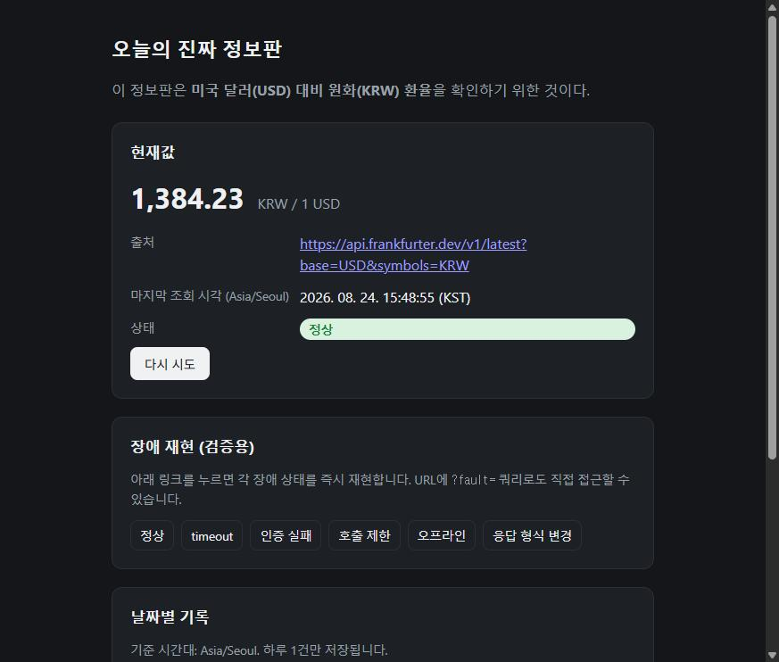
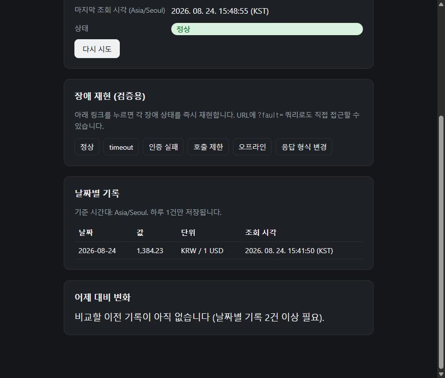
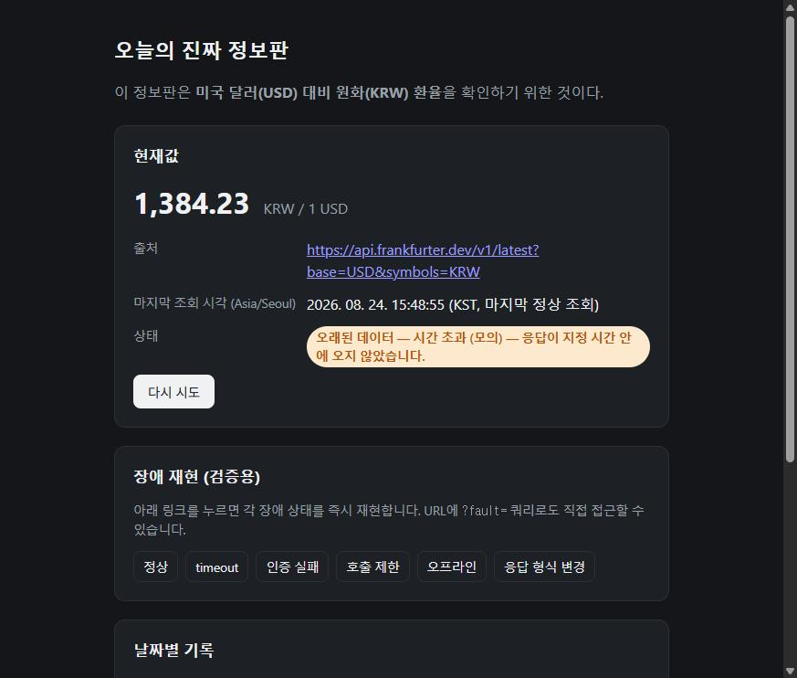

# 오늘의 진짜 정보판 — USD/KRW 환율

실제로 변하는 데이터(미국 달러 대비 원화 환율)를 값·단위·출처·조회 시각과 함께 보여주는
개인 정보판. Frankfurter API(키 불필요)를 사용하고, GitHub Actions가 하루 1회 스냅샷을
`data/history.json`에 기록해 날짜별 기록과 어제 대비 변화를 보여준다.

## 검증 안내서

- **어디로 가나요**: `<배포 후 Vercel 공개 주소를 여기에 채우세요>`
- **무엇을 하나요** (3단계, 30초 이내):
  1. 위 주소로 접속한다.
  2. "현재값" 카드에서 값·단위·출처·조회 시각을 확인한다.
  3. 출처 링크를 눌러 원자료(JSON) 페이지가 열리는지 확인한다.
- **무엇이 보이면 통과인가요**:
  - 현재값·단위·출처·마지막 조회 시각이 한 화면에 보인다.
  - 출처 링크를 누르면 원자료 페이지가 새 탭에서 열린다.
  - 상태 배지가 "정상" 또는 "오래된 데이터 — (사유)"로 표시되어 현재/오래된 자료가 구분된다.
  - "날짜별 기록" 표에 날짜가 중복 없이 쌓이고, "어제 대비 변화"에 차이·방향·단위가 보인다
    (기록이 1건뿐이면 "비교할 이전 기록이 아직 없습니다"라고 정직하게 표시된다).
- **안 될 때**:
  - URL에 `?fault=...`가 붙어있지 않은지 확인한다 (기본 주소로 재접속).
  - "다시 시도" 버튼을 눌러본다.
  - 그래도 안 되면 네트워크 연결 상태와 https://api.frankfurter.dev 상태를 확인한다.

## 장애 재현 (검증용)

기본 주소에 `?fault=` 쿼리를 붙이면 각 장애 상태를 즉시 재현합니다.

| 값 | 재현되는 상태 |
|---|---|
| `timeout` | 시간 초과 |
| `auth` | 인증 실패 (401 모의) |
| `ratelimit` | 호출 제한 (429 모의) |
| `offline` | 오프라인 (모의) |
| `format` | 응답 형식 변경 (모의) |

모든 경우 마지막 정상값을 유지하며 "오래된 데이터" 배지와 사유가 함께 표시됩니다.

## 스크린샷

| 정상 상태 | 날짜별 기록 / 비교 | 장애 재현 (timeout) |
|---|---|---|
|  |  |  |

## 개발/배포 메모 (제출 화면에는 남기지 않음)

- 데이터 출처: https://www.frankfurter.dev/ (ECB 환율, 키 불필요)
- 기준 시간대: Asia/Seoul
- 하루 1회 기록: `.github/workflows/daily-fetch.yml` → `scripts/fetch-daily.mjs`
  - 매일 00:10 UTC(09:10 KST) 실행, 같은 날짜 중복 방지
  - `workflow_dispatch`로 수동 실행 가능 (테스트용)
- 배포: Vercel에 이 저장소를 연결하면 정적 파일(`index.html`, `styles.css`, `app.js`,
  `data/history.json`)이 그대로 서빙됩니다. 빌드 설정 불필요.
- 비밀값: 사용하는 API가 키를 요구하지 않으므로 브라우저/배포 파일/Git 기록에 비밀값이 없습니다.
